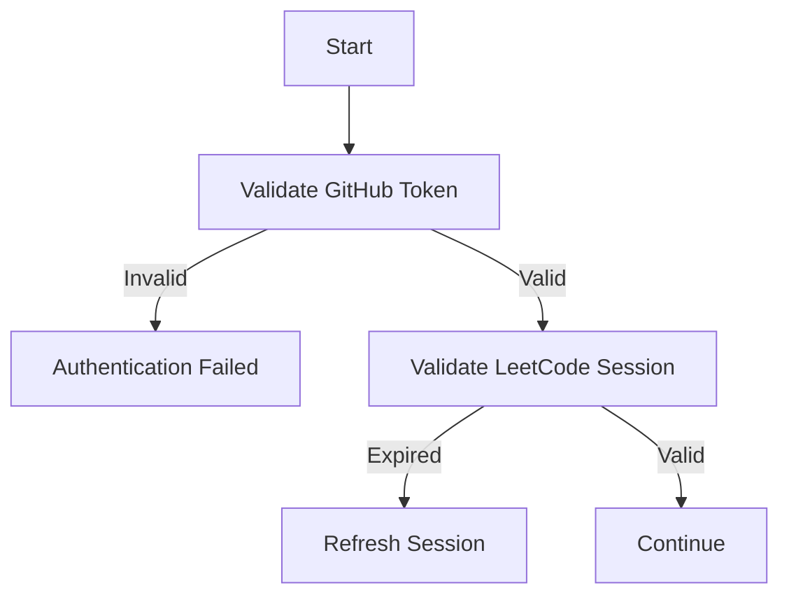
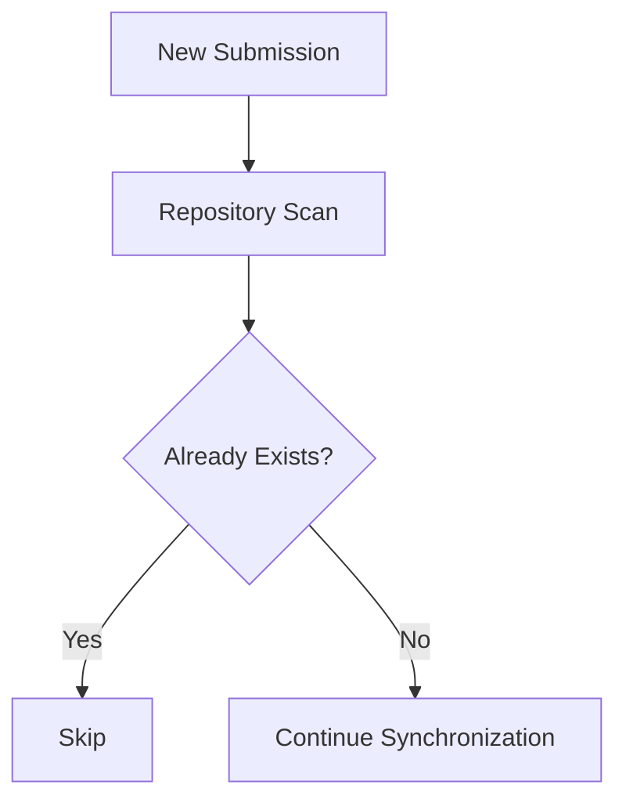
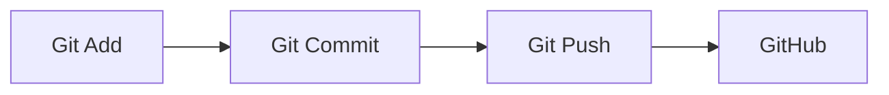
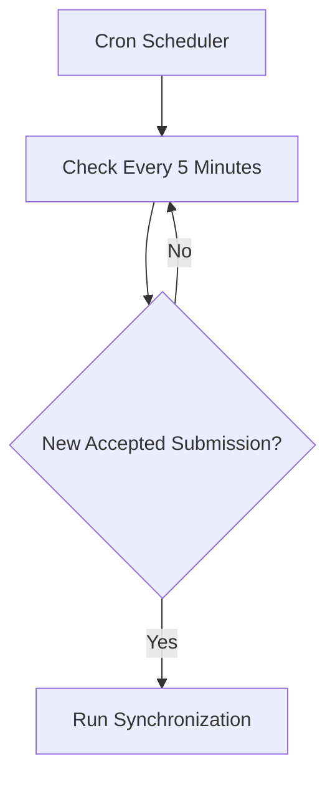
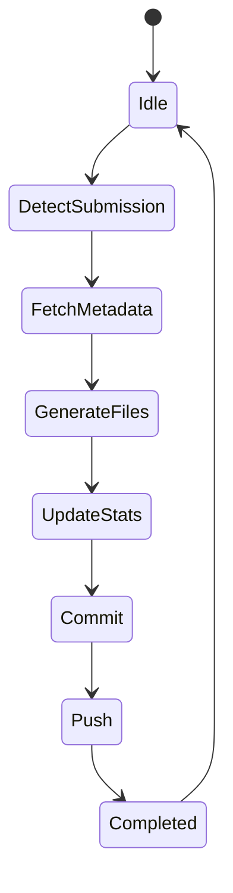
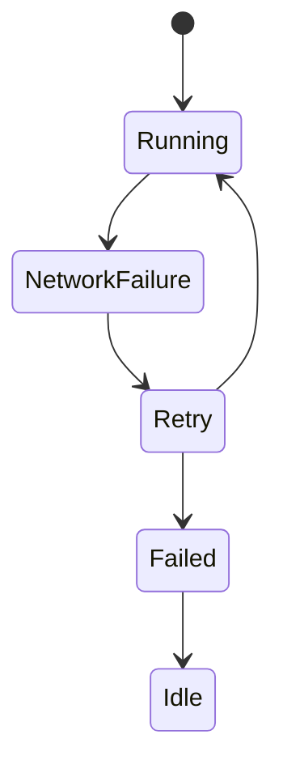

# System Workflow

# LeetSync Pro

Version 1.0

---

# Overview

This document describes the complete lifecycle of LeetSync Pro from the moment a user solves a problem on LeetCode until the solution is synchronized to GitHub.

The workflow emphasizes modularity, fault tolerance, scalability, and future extensibility.

---

# High-Level Workflow

```mermaid
flowchart LR

A[User Solves Problem] --> B[Accepted Submission]

B --> C[Sync Engine Triggered]

C --> D[Fetch Submission Metadata]

D --> E[Retrieve Source Code]

E --> F[Generate Repository Structure]

F --> G[Generate README]

G --> H[Update Statistics]

H --> I[Git Commit]

I --> J[Push to GitHub]

J --> K[Sync Completed]
```



---

# Complete Workflow

## Step 1

User solves a LeetCode problem.

Example

```
Two Sum
```

Status

```
Accepted
```

---

## Step 2

Synchronization Engine starts.

Possible triggers:

Manual

```
leetsync sync
```

Automatic

```
Scheduler

GitHub Actions

Desktop Agent

Future Browser Extension
```

---

## Step 3

Authenticate

System validates

- GitHub Token

- LeetCode Session

- Repository Access

Failure

↓

Stop Synchronization

↓

Generate Error Log

---

## Authentication Workflow



---

# Fetch Latest Submission

System requests

Latest Accepted Submission

Retrieved Metadata

Problem ID

Problem Name

Difficulty

Language

Topic Tags

Submission Time

Source Code

Example

```
ID

1

Title

Two Sum

Difficulty

Easy

Language

Java

Topics

Array

Hash Table
```

---

# Duplicate Detection

Before creating files

System checks

Repository

↓

Existing Folder

↓

Already Synced?

Workflow



---

# Folder Generation

Target Structure

```
leetcode/

Easy/

Arrays/

0001_Two_Sum/

solution.java

README.md
```

If folders do not exist

↓

Create automatically

---

# README Generation

Generate

Problem Name

Difficulty

Topics

Time Complexity

Space Complexity

Approach

Notes

Example

```
# Two Sum

Difficulty

Easy

Topics

Array

HashMap

Time

O(n)

Space

O(n)
```

---

# Statistics Update

Update

Master README

Statistics JSON

Latest Activity

Example

```
Solved

125

Easy

62

Medium

51

Hard

12

Last Updated

Today
```

---

# Git Workflow



Commit Message

```
Solved #1 Two Sum

(Java)
```

---

# Error Handling

Possible Errors

Authentication Failure

Repository Missing

Internet Failure

Git Conflict

API Timeout

Permission Denied

Each error produces

Timestamp

Error Code

Description

Recovery Suggestion

---

# Retry Strategy

Transient failures

↓

Retry

3 Attempts

↓

Exponential Backoff

```
Attempt 1

2 sec

Attempt 2

5 sec

Attempt 3

10 sec
```

If all retries fail

↓

Generate Log

↓

Stop

---

# Logging Workflow

Every synchronization stores

Start Time

End Time

Problem

Status

Execution Time

Example

```
Sync Started

12:05 PM

Fetching Metadata

Completed

Creating Folder

Completed

Updating README

Completed

Git Push

Completed

Finished

12:05:18 PM
```

---

# Scheduler Workflow

Future Version



---

# Recovery Workflow

If synchronization stops

↓

Store checkpoint

↓

Resume

↓

Avoid duplicate commits

---

# Data Flow

```mermaid
flowchart LR

LeetCode

-->

Sync Engine

-->

Metadata Generator

-->

Repository Manager

-->

Git Manager

-->

GitHub
```

---

# Repository Manager Responsibilities

Create folders

Generate files

Update README

Maintain statistics

Delete temporary files

Validate structure

---

# Git Manager Responsibilities

Stage files

Generate commit

Push

Retry failures

Detect merge conflicts

Generate logs

---

# Sync Lifecycle



---

# Failure Lifecycle



---

# Future Workflow

Version 2

AI generates

Problem explanation

↓

Complexity analysis

↓

Revision notes

↓

Interview tips

↓

Personalized learning recommendations

---

# End-to-End Summary

User

↓

Accepted Submission

↓

Authentication

↓

Fetch Metadata

↓

Generate Repository

↓

Generate Documentation

↓

Update Statistics

↓

Git Commit

↓

Git Push

↓

Synchronization Complete